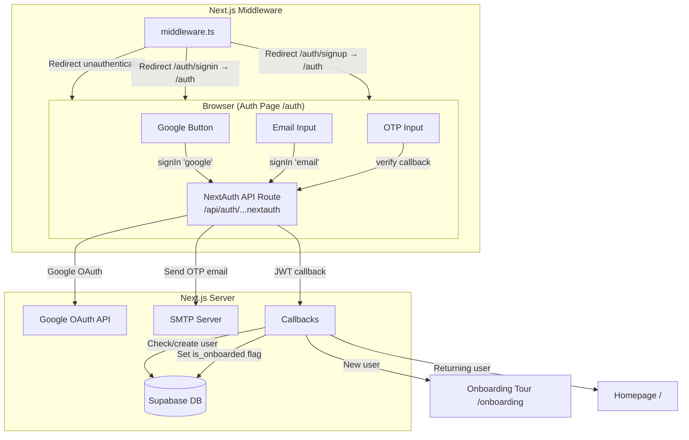
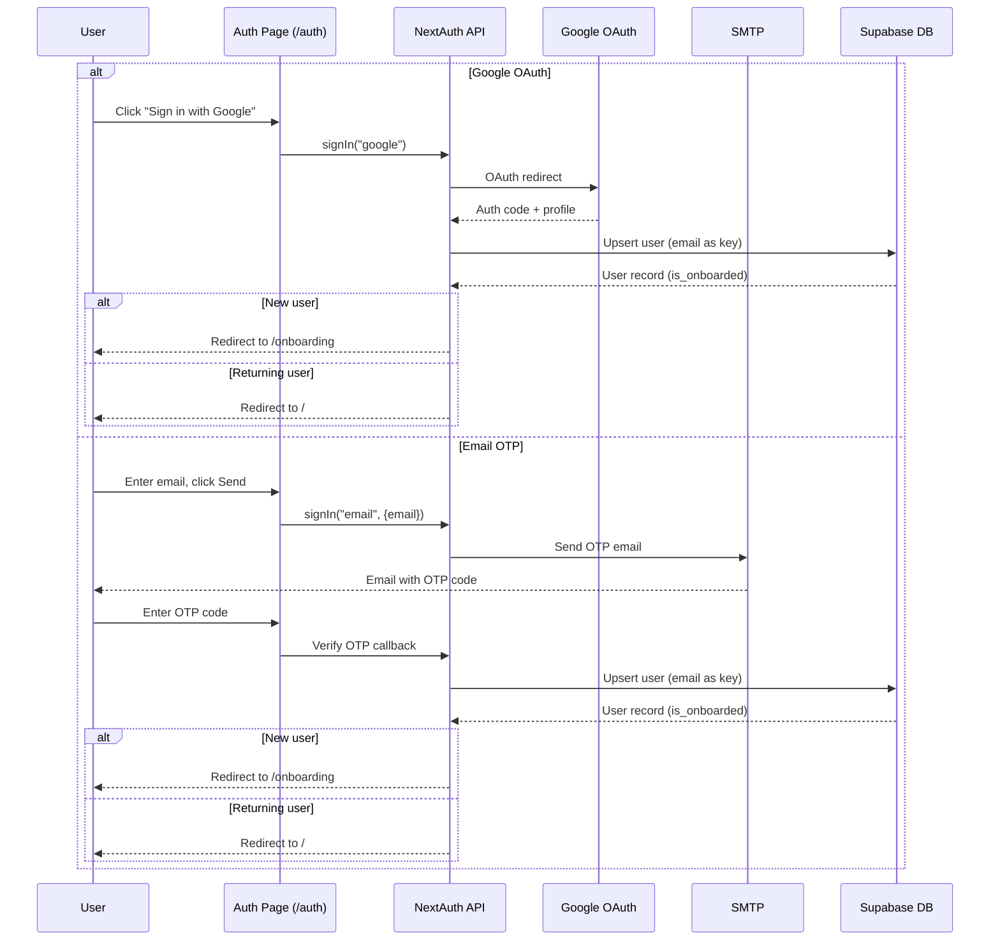

# Design Document: Google Login (Passwordless Auth)

## Overview

This design replaces PalAI's existing credentials-based authentication with a passwordless system using Google OAuth and email OTP. The current `CredentialsProvider` in the NextAuth route handler is removed. A single unified `/auth` page replaces the separate `/auth/signin` and `/auth/signup` pages. New users are detected via an `is_onboarded` flag in the Supabase `users` table and routed to an onboarding tour; returning users go straight to the homepage.

The system uses:
- **NextAuth v4** (`next-auth@^4.24.5`, already installed) with `GoogleProvider` and `EmailProvider`
- **Supabase PostgreSQL** for user persistence and the onboarding flag
- **Nodemailer** (via NextAuth's built-in email transport) for OTP delivery
- **Next.js 15 App Router** for page routing and middleware

## Architecture



### Authentication Flow Sequence



## Components and Interfaces

### 1. NextAuth Configuration (`apps/palai/src/app/api/auth/[...nextauth]/route.ts`)

Replaces the current `CredentialsProvider` setup with:

```typescript
// Providers array (conditionally includes Google)
providers: [
  ...(process.env.GOOGLE_CLIENT_ID && process.env.GOOGLE_CLIENT_SECRET
    ? [GoogleProvider({
        clientId: process.env.GOOGLE_CLIENT_ID,
        clientSecret: process.env.GOOGLE_CLIENT_SECRET,
      })]
    : []),
  EmailProvider({
    server: {
      host: process.env.EMAIL_SERVER_HOST,
      port: Number(process.env.EMAIL_SERVER_PORT),
      auth: {
        user: process.env.EMAIL_SERVER_USER,
        pass: process.env.EMAIL_SERVER_PASSWORD,
      },
    },
    from: process.env.EMAIL_FROM,
    maxAge: 10 * 60, // 10 minutes
  }),
]
```

Key callbacks:
- `signIn`: Upserts user in Supabase by email, creates record if new
- `jwt`: Attaches `userId` and `isOnboarded` to the JWT token
- `redirect`: Routes new users to `/onboarding`, returning users to `/`
- `session`: Exposes `userId` and `isOnboarded` on the session object

### 2. Auth Page (`apps/palai/src/app/auth/page.tsx`)

A client component with two states:
- **Initial state**: Shows Google button + email input with "or" divider
- **OTP verification state**: Shows OTP code input with resend option

No password fields. No sign-in/sign-up distinction.

Interface:
```typescript
// Internal component state
type AuthView = 'initial' | 'otp-verify';

interface AuthPageState {
  view: AuthView;
  email: string;
  otpCode: string;
  error: string | null;
  loading: boolean;
}
```

### 3. Onboarding Tour (`apps/palai/src/app/onboarding/page.tsx`)

A client component that walks new users through PalAI's core features. On completion or skip, it calls a server action to set `is_onboarded = true` in Supabase and redirects to `/`.

### 4. Middleware (`apps/palai/middleware.ts`)

Handles:
- Redirecting unauthenticated users to `/auth` for protected routes
- Redirecting `/auth/signin` and `/auth/signup` to `/auth` (legacy consolidation)
- Allowing `/auth`, `/api/auth/*`, and static assets through without auth check

### 5. Auth Utility (`apps/palai/src/lib/auth.ts`)

Exports the NextAuth configuration and helper functions:
```typescript
export const authOptions: NextAuthOptions;
export function getProviders(): Provider[];  // Conditionally builds provider list
export async function upsertUser(email: string, name?: string, image?: string): Promise<{id: string, isOnboarded: boolean}>;
export async function markUserOnboarded(userId: string): Promise<void>;
```

### 6. Email Validation Utility (`apps/palai/src/lib/validation.ts`)

```typescript
export function isValidEmail(email: string): boolean;
```

Client-side email format validation before submitting to NextAuth. Uses a standard RFC 5322 regex pattern.

## Data Models

### Users Table (Supabase) — Updated Schema

The existing `users` table needs two new columns:

```sql
ALTER TABLE users
  ADD COLUMN image_url TEXT,
  ADD COLUMN is_onboarded BOOLEAN NOT NULL DEFAULT false;
```

Updated TypeScript type:

```typescript
// In apps/palai/src/types/database.ts
users: {
  Row: {
    id: string;
    email: string;
    name: string;
    role: 'FARMER' | 'ADMIN';
    image_url: string | null;
    is_onboarded: boolean;
    created_at: string;
  };
  Insert: {
    id?: string;
    email: string;
    name: string;
    role?: 'FARMER' | 'ADMIN';
    image_url?: string | null;
    is_onboarded?: boolean;
    created_at?: string;
  };
  Update: {
    id?: string;
    email?: string;
    name?: string;
    role?: 'FARMER' | 'ADMIN';
    image_url?: string | null;
    is_onboarded?: boolean;
    created_at?: string;
  };
};
```

### NextAuth Verification Token Table

NextAuth's `EmailProvider` requires a `verification_tokens` table for OTP storage:

```sql
CREATE TABLE verification_tokens (
  identifier TEXT NOT NULL,
  token TEXT NOT NULL UNIQUE,
  expires TIMESTAMPTZ NOT NULL,
  PRIMARY KEY (identifier, token)
);
```

### Session JWT Shape

```typescript
interface ExtendedJWT extends JWT {
  userId: string;
  isOnboarded: boolean;
}

interface ExtendedSession extends Session {
  user: {
    id: string;
    email: string;
    name?: string;
    image?: string;
    isOnboarded: boolean;
  };
}
```

## Correctness Properties

*A property is a characteristic or behavior that should hold true across all valid executions of a system — essentially, a formal statement about what the system should do. Properties serve as the bridge between human-readable specifications and machine-verifiable correctness guarantees.*

### Property 1: Conditional Google provider inclusion

*For any* combination of `GOOGLE_CLIENT_ID` and `GOOGLE_CLIENT_SECRET` environment variable states (present or absent), the NextAuth providers array should include the Google provider if and only if both variables are defined and non-empty.

**Validates: Requirements 1.4**

### Property 2: Invalid email rejection

*For any* string that does not conform to a valid email format (e.g., missing `@`, missing domain, whitespace-only, empty string), the email validation function should return false, and the auth page should not initiate an OTP send.

**Validates: Requirements 2.4**

### Property 3: Onboarding flag round-trip

*For any* user, after `upsertUser` creates a new record the `is_onboarded` flag should be `false`; after calling `markUserOnboarded`, querying the same user should return `is_onboarded` as `true`.

**Validates: Requirements 4.1, 4.4**

### Property 4: Post-auth redirect based on onboarding status

*For any* authenticated user, the post-authentication redirect URL should be `/onboarding` when `is_onboarded` is `false`, and `/` when `is_onboarded` is `true`.

**Validates: Requirements 4.2, 5.1, 5.2**

### Property 5: Session contains user identity

*For any* authentication method (Google or email) and any valid user profile, the resulting session object should contain at minimum the user's `email` and `id`. When the provider supplies `name` and `image` (as Google does), those should also be present in the session.

**Validates: Requirements 6.1, 6.2, 6.3**

### Property 6: Cross-provider account linking by email

*For any* email address, if a user authenticates first via Google and then via email OTP (or vice versa) using the same email, both authentications should resolve to the same user record in the database.

**Validates: Requirements 6.4**

## Error Handling

| Scenario                   | Handling                                                                                                                              |
| -------------------------- | ------------------------------------------------------------------------------------------------------------------------------------- |
| Google env vars missing    | Omit Google provider from config; log warning via `console.warn`. Auth page hides Google button if provider unavailable.              |
| Email delivery failure     | NextAuth surfaces error via `signIn` return value. Auth page displays "Failed to send code. Please try again." with retry option.     |
| Invalid email format       | Client-side validation rejects before calling `signIn`. Displays inline error "Please enter a valid email address."                   |
| Incorrect OTP code         | NextAuth returns error on callback. Auth page displays "Invalid code. Please try again." and keeps OTP input active.                  |
| Expired OTP code           | NextAuth returns error (token expired). Auth page displays "Code expired. Request a new one." with resend button.                     |
| Supabase upsert failure    | Catch in `signIn` callback, return `false` to deny sign-in. Log error server-side. User sees generic "Authentication failed" message. |
| Network error during OAuth | Google OAuth redirect fails. Browser shows error. User can retry from auth page.                                                      |
| Session expired            | Middleware detects missing/invalid JWT. Redirects to `/auth`.                                                                         |
| Concurrent OTP requests    | NextAuth's `verification_tokens` table uses unique token constraint. Latest token wins; previous tokens remain valid until expiry.    |

## Testing Strategy

### Property-Based Tests (using `fast-check` + `vitest`)

The project already has `fast-check@^4.6.0` and `vitest@^1.1.0` in devDependencies. Each property test runs a minimum of 100 iterations.

| Property   | Test Description                                                                                                                              | Tag                                                                                |
| ---------- | --------------------------------------------------------------------------------------------------------------------------------------------- | ---------------------------------------------------------------------------------- |
| Property 1 | Generate random boolean pairs for env var presence, verify provider array                                                                     | `Feature: google-login, Property 1: Conditional Google provider inclusion`         |
| Property 2 | Generate arbitrary strings (including edge cases like unicode, whitespace, partial emails), verify `isValidEmail` rejects all invalid formats | `Feature: google-login, Property 2: Invalid email rejection`                       |
| Property 3 | Generate random email/name pairs, call `upsertUser` then `markUserOnboarded`, verify flag transitions                                         | `Feature: google-login, Property 3: Onboarding flag round-trip`                    |
| Property 4 | Generate random boolean `isOnboarded` values, verify redirect URL mapping                                                                     | `Feature: google-login, Property 4: Post-auth redirect based on onboarding status` |
| Property 5 | Generate random user profiles with varying fields (email always present, name/image optional), verify session shape                           | `Feature: google-login, Property 5: Session contains user identity`                |
| Property 6 | Generate random emails, simulate upsert from two different providers, verify same user ID returned                                            | `Feature: google-login, Property 6: Cross-provider account linking by email`       |

### Unit Tests (using `vitest` + `@testing-library/react`)

Unit tests cover specific examples, edge cases, and UI rendering:

- **Auth page rendering**: Google button present, email input present, "or" divider present, no password fields (validates 3.1–3.4)
- **Google button click**: Calls `signIn("google")` (validates 3.6)
- **Email submit → OTP view transition**: Submitting valid email switches to OTP input view (validates 3.7)
- **OTP error display**: Incorrect OTP shows error message (validates 3.9)
- **OTP expiry handling**: Expired OTP shows expiry message with resend option (validates 3.10)
- **Legacy redirect**: Middleware redirects `/auth/signin` and `/auth/signup` to `/auth` (validates 7.3)
- **NextAuth config**: `pages.signIn` is set to `/auth` (validates 7.4)
- **OTP maxAge**: EmailProvider configured with `maxAge: 600` (validates 2.3)
- **Onboarding tour**: Renders core feature introduction; skip/complete triggers `markUserOnboarded` (validates 4.3, 4.4)

### Integration Tests (using Playwright)

E2E tests for the full authentication flows:
- Google OAuth flow (with mocked Google responses)
- Email OTP flow end-to-end
- New user → onboarding → homepage flow
- Returning user → direct homepage redirect
