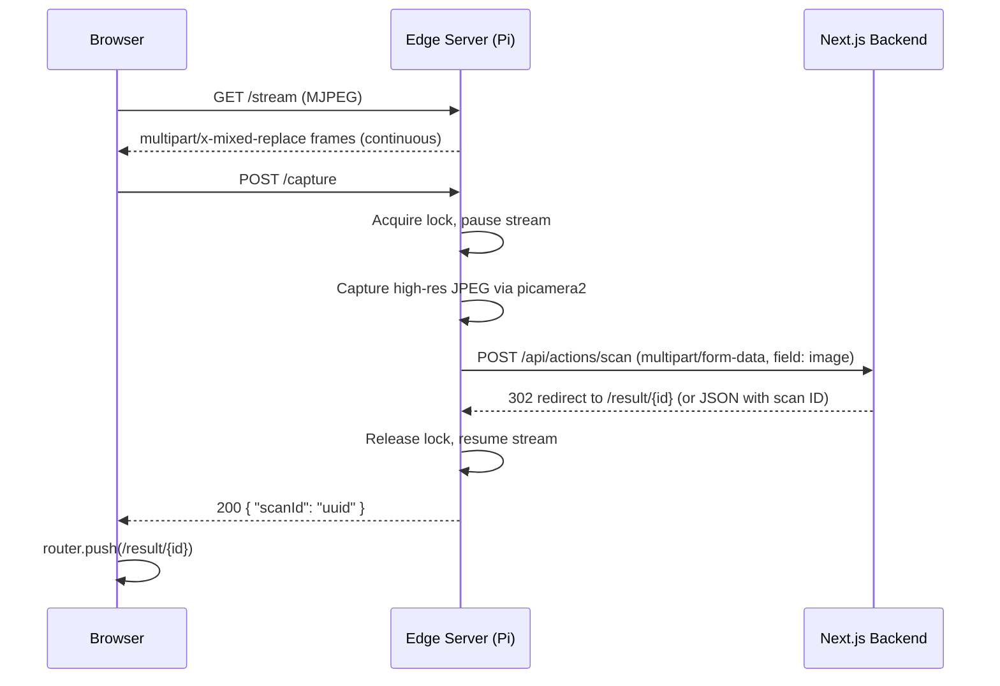

# Design Document: Remote Camera Hub

## Overview

This feature adds a Raspberry Pi 4 edge device ("PalAI Hub") as a remote camera source for the PalAI rice leaf disease classification app. The system has two main parts:

1. **Edge Server** — A Python Flask application running on the Pi that manages the camera module, serves an MJPEG live preview stream, captures high-resolution images on demand, and forwards them to the existing PalAI backend for AI diagnosis.
2. **Frontend Integration** — New UI components on the Next.js `/scan` page that let users toggle between the existing mobile camera and the remote PalAI Hub, view the live MJPEG stream, and trigger remote captures with results flowing through the existing `uploadAndDiagnose` pipeline.

The edge server is exposed to the internet via Cloudflare Tunnel. The frontend discovers it through the `NEXT_PUBLIC_PI_TUNNEL_URL` environment variable. When this variable is absent, the Hub option is hidden and the app behaves exactly as it does today.

### Key Design Decisions

- **Flask over FastAPI**: Flask is chosen for the edge server because `picamera2` is synchronous and the Pi runs a single camera — there's no concurrency benefit from async. Flask keeps the dependency footprint minimal.
- **Server-side forwarding**: The edge server captures the image and POSTs it directly to the PalAI backend (`uploadAndDiagnose` server action endpoint). This avoids transferring large images through the browser and keeps the existing API contract intact.
- **Threading lock for capture coordination**: A simple `threading.Lock` guards the camera resource during high-res capture, pausing the MJPEG stream and rejecting concurrent capture requests with 429.
- **No changes to existing ML or server action code**: The edge server conforms to the existing `multipart/form-data` contract expected by `uploadAndDiagnose`.

## Architecture

```mermaid
graph TB
    subgraph "User's Browser"
        SP[Scan Page]
        ST[SourceToggle]
        CC[CameraCapture]
        HS[HubStream]
        HCB[HubCaptureButton]
    end

    subgraph "Next.js Backend (Vercel)"
        SA[uploadAndDiagnose Server Action]
        API[/api/ai/diagnose]
        DB[(Supabase)]
    end

    subgraph "Raspberry Pi 4 (Edge)"
        ES[Flask Edge Server]
        CAM[Camera Module]
    end

    ST -->|"Mobile Camera"| CC
    ST -->|"PalAI Hub"| HS
    ST -->|"PalAI Hub"| HCB

    HS -->|"GET /stream (MJPEG)"| ES
    HCB -->|"POST /capture"| ES

    ES -->|picamera2| CAM
    ES -->|"POST multipart/form-data"| SA

    SA --> API
    API --> DB

    SA -->|"redirect /result/{id}"| SP
```

### Request Flow: Remote Capture



## Components and Interfaces

### Edge Server (Python Flask)

#### Module: `edge_hub/app.py`

The single Flask application file containing all endpoints and camera management.

**Endpoints:**

| Endpoint   | Method | Description                                   |
| ---------- | ------ | --------------------------------------------- |
| `/stream`  | GET    | MJPEG live preview stream                     |
| `/capture` | POST   | Trigger high-res capture + forward to backend |
| `/health`  | GET    | Health check (camera status)                  |

**Camera Manager (internal):**

```python
class CameraManager:
    """Manages picamera2 lifecycle and coordinates stream/capture."""

    def __init__(self, preview_size=(640, 480), capture_size=(1920, 1080)):
        self.camera = Picamera2()
        self.preview_config = camera.create_preview_configuration(
            main={"size": preview_size, "format": "RGB888"}
        )
        self.capture_config = camera.create_still_configuration(
            main={"size": capture_size, "format": "RGB888"}
        )
        self._capture_lock = threading.Lock()
        self._is_capturing = False

    def generate_frames(self) -> Generator[bytes, None, None]:
        """Yields MJPEG frames for streaming. Pauses during capture."""
        ...

    def capture_image(self) -> bytes:
        """
        Acquires lock, switches to still config, captures JPEG,
        switches back to preview config, releases lock.
        Returns JPEG bytes.
        Raises CaptureInProgressError if lock is held.
        """
        ...
```

**Key behaviors:**
- `generate_frames()` checks `_is_capturing` flag each iteration; when True, it yields nothing (stream pauses).
- `capture_image()` uses `_capture_lock.acquire(blocking=False)` — if it fails, raises `CaptureInProgressError` (mapped to 429).
- CORS is handled via `flask-cors` with configurable allowed origins.

#### Module: `edge_hub/config.py`

```python
import os
import sys

PALAI_API_URL = os.environ.get("PALAI_API_URL")
HOST = os.environ.get("EDGE_HOST", "0.0.0.0")
PORT = int(os.environ.get("EDGE_PORT", "5000"))
CORS_ORIGINS = os.environ.get("CORS_ORIGINS", "*")

if not PALAI_API_URL:
    print("ERROR: PALAI_API_URL environment variable is required.", file=sys.stderr)
    sys.exit(1)
```

### Frontend Components (Next.js / TypeScript)

#### `SourceToggle` — `apps/palai/src/components/scan/SourceToggle.tsx`

A segmented control that switches between "Mobile Camera" and "PalAI Hub" modes.

```typescript
interface SourceToggleProps {
  source: "mobile" | "hub";
  onSourceChange: (source: "mobile" | "hub") => void;
}
```

- Only rendered when `NEXT_PUBLIC_PI_TUNNEL_URL` is set (non-empty).
- Uses Tailwind CSS pill-style toggle with `Smartphone` and `Radio` icons from Lucide React.
- Defaults to `"mobile"` on mount.

#### `HubStream` — `apps/palai/src/components/scan/HubStream.tsx`

Displays the live MJPEG feed from the edge server.

```typescript
interface HubStreamProps {
  tunnelUrl: string;
  onError: (message: string) => void;
}
```

- Renders an `` element.
- Fills the camera viewfinder area with `object-cover` and maintains aspect ratio.
- Listens for `onerror` on the `` to detect connection loss and calls `onError`.
- Shows a reconnection message with a retry button on error.

#### `HubCaptureButton` — `apps/palai/src/components/scan/HubCaptureButton.tsx`

Replaces the standard capture button when in Hub mode.

```typescript
interface HubCaptureButtonProps {
  tunnelUrl: string;
  onCaptureStart: () => void;
  onCaptureSuccess: (scanId: string) => void;
  onCaptureError: (message: string) => void;
  disabled: boolean;
}
```

- Sends `POST {tunnelUrl}/capture` via `fetch`.
- Calls `onCaptureStart` immediately to trigger loading overlay.
- On success (200 with `{ scanId }`), calls `onCaptureSuccess`.
- On 429, shows "Capture already in progress" message.
- On other errors or timeout (30s), calls `onCaptureError`.
- Button is disabled while `disabled` prop is true (prevents double-tap).

#### Updated `ScanPage` — `apps/palai/src/app/scan/page.tsx`

The existing scan page gains:
- A `source` state (`"mobile" | "hub"`) defaulting to `"mobile"`.
- Conditional rendering: when `source === "hub"`, shows `HubStream` + `HubCaptureButton` instead of `CameraCapture`.
- When `source === "hub"`, hides the `ImageUpload` / drag-and-drop option.
- The `SourceToggle` is only rendered when `process.env.NEXT_PUBLIC_PI_TUNNEL_URL` is truthy.
- On successful hub capture, calls `router.push(\`/result/${scanId}\`)`.

#### Custom Hook: `useHubCapture` — `apps/palai/src/hooks/useHubCapture.ts`

Encapsulates the capture request logic for cleaner page code.

```typescript
interface UseHubCaptureReturn {
  isCapturing: boolean;
  error: string | null;
  triggerCapture: () => Promise<string>; // returns scanId
  clearError: () => void;
}

function useHubCapture(tunnelUrl: string): UseHubCaptureReturn;
```

- Manages `AbortController` for cleanup on unmount.
- Sets 30-second timeout on the fetch request.
- Returns the `scanId` from the edge server response on success.

## Data Models

### Edge Server Request/Response Schemas

#### `POST /capture` Response (Success — 200)

```json
{
  "scanId": "uuid-string"
}
```

#### `POST /capture` Response (Capture in progress — 429)

```json
{
  "error": "Capture already in progress. Please wait."
}
```

#### `POST /capture` Response (Camera unavailable — 503)

```json
{
  "error": "Camera module is unavailable."
}
```

#### `POST /capture` Response (Backend error — 502)

```json
{
  "error": "Diagnosis service returned an error.",
  "details": "..."
}
```

#### `GET /health` Response (200)

```json
{
  "status": "ok",
  "camera": "ready"
}
```

### Edge Server → Next.js Backend Request

The edge server forwards the captured image as `multipart/form-data` to the `uploadAndDiagnose` server action. The form fields match the existing contract:

| Field    | Type        | Description                         |
| -------- | ----------- | ----------------------------------- |
| `image`  | File (JPEG) | The captured high-resolution image  |
| `locale` | string      | Language locale, defaults to `"en"` |

### Frontend State Model

```typescript
// Scan page state additions
type CameraSource = "mobile" | "hub";

interface HubCaptureState {
  isCapturing: boolean;
  error: string | null;
}

// Environment
const PI_TUNNEL_URL: string | undefined = process.env.NEXT_PUBLIC_PI_TUNNEL_URL;
const isHubAvailable: boolean = !!PI_TUNNEL_URL && PI_TUNNEL_URL.length > 0;
```

### Environment Variables

| Variable                    | Location         | Required | Default   | Description                                        |
| --------------------------- | ---------------- | -------- | --------- | -------------------------------------------------- |
| `PALAI_API_URL`             | Edge Server (Pi) | Yes      | —         | URL of the Next.js backend for forwarding captures |
| `EDGE_HOST`                 | Edge Server (Pi) | No       | `0.0.0.0` | Host to bind the Flask server                      |
| `EDGE_PORT`                 | Edge Server (Pi) | No       | `5000`    | Port to bind the Flask server                      |
| `CORS_ORIGINS`              | Edge Server (Pi) | No       | `*`       | Allowed CORS origins                               |
| `NEXT_PUBLIC_PI_TUNNEL_URL` | Next.js Frontend | No       | —         | Public URL of the edge server tunnel               |

## Correctness Properties

*A property is a characteristic or behavior that should hold true across all valid executions of a system — essentially, a formal statement about what the system should do. Properties serve as the bridge between human-readable specifications and machine-verifiable correctness guarantees.*

### Property 1: Stream endpoint content type

*For any* GET request to `/stream`, the response `Content-Type` header shall be exactly `multipart/x-mixed-replace; boundary=frame`.

**Validates: Requirements 1.1**

### Property 2: Stream frame resolution bound

*For any* frame yielded by the MJPEG stream generator, its decoded image dimensions shall be at most 640×480 pixels.

**Validates: Requirements 1.2**

### Property 3: CORS headers on stream

*For any* GET request to `/stream`, the response shall include an `Access-Control-Allow-Origin` header.

**Validates: Requirements 1.4**

### Property 4: Capture produces high-resolution image

*For any* successful POST to `/capture`, the image captured from the camera shall have dimensions of at least 1920×1080 pixels.

**Validates: Requirements 2.1**

### Property 5: Capture forwards image as multipart/form-data

*For any* successful capture, the edge server shall send a POST request to `PALAI_API_URL` with a `multipart/form-data` body containing a field named `image` with JPEG content.

**Validates: Requirements 2.2**

### Property 6: Capture success response contains scan ID

*For any* capture where the backend returns a successful response with a scan ID, the `/capture` endpoint shall respond with HTTP 200 and a JSON body containing that same `scanId` value.

**Validates: Requirements 2.3**

### Property 7: Backend error propagation

*For any* capture where the backend returns an error status code, the `/capture` endpoint shall respond with a non-2xx HTTP status and a JSON body containing an `error` field.

**Validates: Requirements 2.4**

### Property 8: Stream pause/resume round-trip during capture

*For any* capture operation, the MJPEG stream shall yield no frames while the capture lock is held, and shall resume yielding frames after the lock is released.

**Validates: Requirements 3.1, 3.2**

### Property 9: Concurrent capture rejection

*For any* state where a capture is already in progress, a subsequent POST to `/capture` shall return HTTP 429 with a JSON body containing an `error` field.

**Validates: Requirements 3.3**

### Property 10: Source toggle controls component rendering

*For any* source state value, when source is `"hub"` the page shall render `HubStream` and `HubCaptureButton` and shall not render `CameraCapture` or the image upload area; when source is `"mobile"` the page shall render `CameraCapture` and shall not render `HubStream` or `HubCaptureButton`.

**Validates: Requirements 5.3, 5.4, 5.6, 7.1**

### Property 11: Hub capture sends POST to correct URL

*For any* tunnel URL value and capture trigger, the fetch call shall be a POST request to `{tunnelUrl}/capture`.

**Validates: Requirements 7.2**

### Property 12: Successful capture redirects to result page

*For any* scan ID returned by a successful capture response, the page shall navigate to `/result/{scanId}`.

**Validates: Requirements 7.4**

### Property 13: Capture button disabled during capture

*For any* state where `isCapturing` is true, the "Capture from Hub" button shall have its `disabled` attribute set to true.

**Validates: Requirements 7.6**

### Property 14: Toggle visibility depends on environment variable

*For any* value of `NEXT_PUBLIC_PI_TUNNEL_URL`, the `SourceToggle` component shall be rendered if and only if the value is a non-empty string.

**Validates: Requirements 8.2, 8.3**

## Error Handling

### Edge Server Errors

| Scenario                    | HTTP Status | Response Body                                                           | Recovery                         |
| --------------------------- | ----------- | ----------------------------------------------------------------------- | -------------------------------- |
| Camera module unavailable   | 503         | `{ "error": "Camera module is unavailable." }`                          | User retries; server logs error  |
| Capture already in progress | 429         | `{ "error": "Capture already in progress. Please wait." }`              | User waits and retries           |
| Backend diagnosis failure   | 502         | `{ "error": "Diagnosis service returned an error.", "details": "..." }` | User retries; check backend logs |
| Backend unreachable         | 502         | `{ "error": "Could not reach diagnosis service." }`                     | Check network/tunnel config      |
| Invalid request             | 400         | `{ "error": "..." }`                                                    | Fix request format               |
| `PALAI_API_URL` not set     | —           | Process exits with stderr message                                       | Set the env var and restart      |

### Frontend Errors

| Scenario                            | Behavior                                                                     | Recovery                                       |
| ----------------------------------- | ---------------------------------------------------------------------------- | ---------------------------------------------- |
| MJPEG stream fails to load          | `HubStream` shows error message with "Hub unreachable" text and retry button | User clicks retry or switches to mobile camera |
| Capture request fails (network)     | Error toast/message displayed, capture button re-enabled                     | User retries                                   |
| Capture request times out (30s)     | AbortController cancels fetch, error message shown                           | User retries                                   |
| Capture returns 429                 | "Capture in progress" message shown                                          | User waits briefly                             |
| Capture returns 503                 | "Camera unavailable" error shown                                             | User retries or checks Hub                     |
| `NEXT_PUBLIC_PI_TUNNEL_URL` not set | SourceToggle hidden, app behaves as before                                   | No action needed — graceful degradation        |

### Error Boundaries

- The `HubStream` component handles its own `` load errors internally.
- The `useHubCapture` hook catches all fetch errors and surfaces them via the `error` state.
- The scan page wraps hub-specific logic so that errors in hub mode never break the mobile camera fallback.

## Testing Strategy

### Property-Based Testing

**Library:** `pytest` + `hypothesis` for the Edge Server (Python), `fast-check` for the Frontend (TypeScript).

Each property-based test must:
- Run a minimum of 100 iterations
- Reference its design property via a comment tag: `Feature: remote-camera-hub, Property {N}: {title}`

**Edge Server Properties (Python / Hypothesis):**

| Property   | Test Description                                                                                 |
| ---------- | ------------------------------------------------------------------------------------------------ |
| Property 1 | Generate random GET requests to /stream, assert Content-Type header                              |
| Property 2 | Generate frames from mock camera, decode each, assert width ≤ 640 and height ≤ 480               |
| Property 3 | Generate random GET requests to /stream, assert CORS header present                              |
| Property 4 | Generate mock captures, decode resulting JPEG, assert width ≥ 1920 and height ≥ 1080             |
| Property 5 | Generate mock captures, intercept outbound POST, assert multipart/form-data with "image" field   |
| Property 6 | Generate random scan IDs, mock backend success, assert /capture returns 200 with matching scanId |
| Property 7 | Generate random error codes from backend, assert /capture returns non-2xx with error field       |
| Property 8 | Trigger capture, assert stream generator yields nothing during lock, resumes after               |
| Property 9 | Hold capture lock, send second /capture, assert 429 with error field                             |

**Frontend Properties (TypeScript / fast-check):**

| Property    | Test Description                                                                               |
| ----------- | ---------------------------------------------------------------------------------------------- |
| Property 10 | Generate random source states, render scan page, assert correct component presence/absence     |
| Property 11 | Generate random tunnel URLs, trigger capture, assert fetch called with POST to {url}/capture   |
| Property 12 | Generate random scan IDs, mock successful capture, assert router.push called with /result/{id} |
| Property 13 | Set isCapturing to true, render button, assert disabled attribute                              |
| Property 14 | Generate random env var values (empty, undefined, valid URLs), assert toggle visibility        |

### Unit Testing

Unit tests complement property tests by covering specific examples and edge cases:

**Edge Server (pytest):**
- Startup fails with descriptive error when `PALAI_API_URL` is missing (Req 4.3)
- Default host/port is `0.0.0.0:5000` (Req 4.4)
- Client disconnect stops frame generation (Req 1.3)
- Camera unavailable returns 503 (Req 2.5)
- `requirements.txt` exists and lists expected packages (Req 4.2)

**Frontend (Vitest + React Testing Library):**
- SourceToggle defaults to "Mobile Camera" on mount (Req 5.2)
- HubStream renders img with correct src (Req 6.1)
- HubStream shows error message on img load failure (Req 6.3)
- LoadingOverlay shown during capture (Req 7.3)
- Capture error shows retry option (Req 7.5)
- SourceToggle not rendered when env var is undefined (Req 8.2)

### Test Configuration

- **Edge Server:** `pytest` with `hypothesis` plugin, `pytest-flask` for test client. Mock `picamera2` with a fake camera class that generates solid-color JPEG frames.
- **Frontend:** `vitest` with `@testing-library/react`, `fast-check` for property tests. Mock `fetch` and `next/navigation` router.
- **CI:** Both test suites run in CI. Edge server tests don't require a real Pi (camera is mocked).
